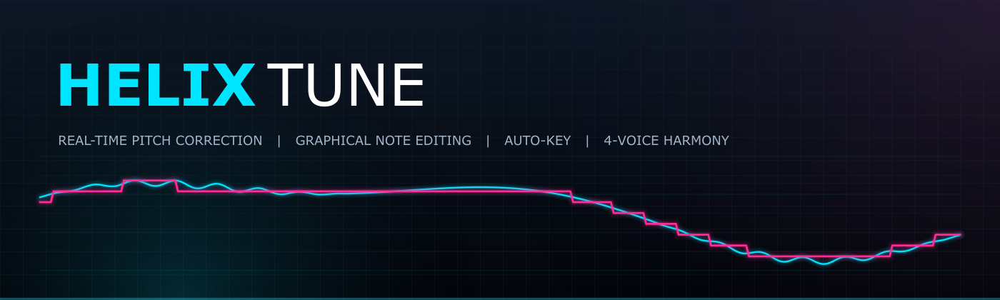
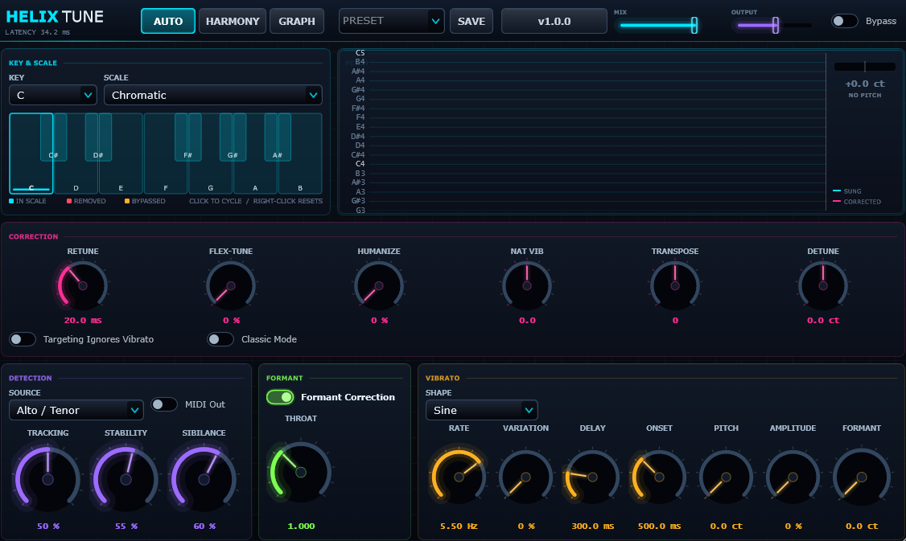
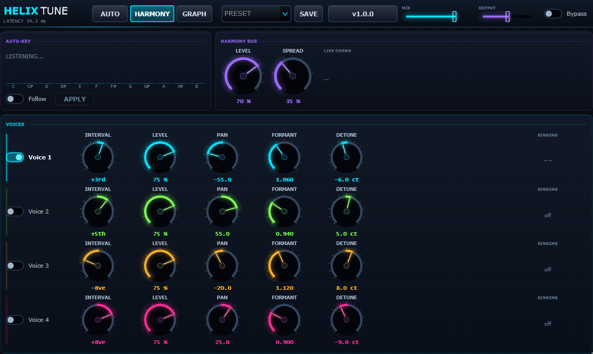
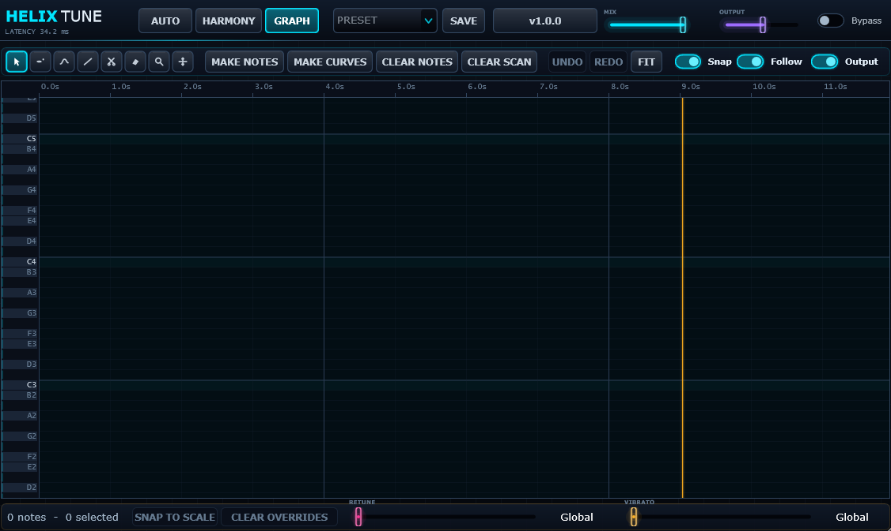

<div align="center">



<br>

**Real-time pitch correction with graphical note editing, automatic key detection and four-voice harmony.**

[](https://github.com/GPTmadeit/HelixTune/releases/latest)
[](https://github.com/GPTmadeit/HelixTune/releases)
[](https://github.com/GPTmadeit/HelixTune/releases/latest)
[](#install)
[](LICENSE)

### [⬇ Download the latest release](https://github.com/GPTmadeit/HelixTune/releases/latest)

Run the installer, open your DAW, and HELIX Tune is in your plugin list.
It checks GitHub for updates and can install them itself.

</div>

---

## What it is

A pitch corrector built the way the classic ones were — pitch-synchronous
time-domain shifting, a real scale engine, and a graphical editor where you draw
the notes you want — plus the things the classics never had: an octave-robust
tracker, true source-filter formant control, and a harmoniser that follows the
key.

It is fast enough to sit on a track and accurate enough to trust: **corrected
pitch lands within 0.1 cents of target**, and the whole chain costs about
**4.5% of one CPU core**.

<table>
<tr>
<td width="50%"><b>Auto mode</b><br><sub>Scale-driven correction, live pitch scope, per-note scale editing</sub></td>
<td width="50%"><b>Harmony mode</b><br><sub>Auto-Key, four diatonic voices, live chord readout</sub></td>
</tr>
<tr>
<td></td>
<td></td>
</tr>
<tr>
<td colspan="2"><b>Graph mode</b> — draw and edit individual notes against the captured performance</td>
</tr>
<tr>
<td colspan="2"></td>
</tr>
</table>

---

## Install

**Windows 10/11, 64-bit.**

1. Download **`HELIX-Tune-x.y.z-Windows.exe`** from the
   [latest release](https://github.com/GPTmadeit/HelixTune/releases/latest).
2. Run it. The VST3 goes to `C:\Program Files\Common Files\VST3`, where every
   DAW looks by default. The standalone app is optional.
3. Rescan plugins in your DAW.

> **Staying up to date.** The version button in the plugin's header checks
> GitHub for new releases and will download and run the installer for you.
> Close your DAW first so the plugin file isn't locked. Automatic checks can
> be turned off from that same menu — the preference is stored per machine,
> not in your project.

<details>
<summary><b>Manual install (no admin rights)</b></summary>

Copy the `HELIX Tune.vst3` folder to:

```
%LOCALAPPDATA%\Programs\Common\VST3
```

Then add that folder to your DAW's plugin search paths.
</details>

---

## Features

### Correction

| | |
|---|---|
| **Retune Speed** | 0–400 ms. Zero is the hard-snap sound. |
| **Humanize** | Relaxes retune *only on sustained notes*, so onsets stay tight. |
| **Flex-Tune** | Correction eases off away from a scale tone, so scoops and slides survive. |
| **Natural Vibrato** | Scales the singer's own vibrato, separated from the pitch contour. |
| **Targeting Ignores Vibrato** | Picks the target from the vibrato-free contour. |
| **Classic Mode** | The faster, harder grab of the early hardware. |
| **Stability** | How stubbornly the tracker holds pitch through ambiguity. |
| **Sibilance Guard** | How aggressively consonants are left uncorrected. |
| **Throat Length** | Moves the vocal tract independently of pitch. |
| **Transpose / Detune** | ±12 semitones, ±100 cents. |

### Scales and tuning

21 scales — major, the modes, pentatonics, blues, diminished, Hungarian minor,
Hirajoshi, double harmonic and more — plus **six historical temperaments**
implemented as real cent-offset tables: Just Intonation, Pythagorean,
quarter-comma Meantone, Werckmeister III, Kirnberger III and Vallotti. Those
aren't note subsets; the note set is the full chromatic and it's the *tuning of
each degree* that moves.

Every pitch class can be **Normal**, **Removed** (never a target) or
**Bypassed** (recognised, but passed through untouched).

### Auto-Key

Listens to the performance and names the key. The pitch-class histogram is
shown next to the answer, so when it picks the relative minor you can see why.
One click applies it, or leave it in follow mode.

### Harmony

Four voices, each with its own formant scaling, pan, detune and timing offset.
Intervals are **scale degrees**, not fixed intervals — a third above the tonic
is four semitones and a third above the second degree is three. The panel shows
the live target note per voice.

### Graph mode

A piano roll showing three layers of pitch at once: what was sung, what you've
asked for, and what is coming out.

Eight tools (`1`–`8`): select/move, draw note, draw curve, pitch line, split,
erase, zoom, pan. **Make Notes** turns the captured contour into flat notes at
the nearest scale pitch; **Make Curves** keeps each note's original shape so
only its centre is corrected. Per-note retune and vibrato overrides, undo/redo,
rubber-band select.

### Also

13 factory presets, user presets, and **MIDI pitch output** with pitch bend
carrying the cents actually sung — so a synth can double the vocal line and
follow the performance rather than a grid.

---

## How it works

<details open>
<summary><b>Pitch detection — YIN plus a Viterbi tracker</b></summary>

<br>

**YIN** (de Cheveigné & Kawahara, 2002) with an FFT-accelerated difference
function and parabolic interpolation, feeding a **Viterbi tracker** over a
lattice of candidate periods.

A single 5 ms frame genuinely cannot tell 220 Hz from 110 Hz — both explain the
waveform, and their costs sit within a fraction of a percent. What separates
them is history. The tracker runs an online forward pass where staying near the
previous pitch is cheap and leaping is expensive but never forbidden, so real
octave leaps still get through once the accumulated cost of persisting at the
wrong octave overtakes the one-off jump penalty.

Building that lattice correctly is subtler than it looks:

> A periodic signal repeats at **every integer multiple** of its period, so 2T,
> 3T, 4T … are all real minima. Worse, YIN's cumulative-mean normalisation
> divides by a running average that grows with τ, so subharmonics score
> **better** than the truth — for a 430 Hz tone, `cmnd` is 0.0014 at T and
> 0.0002 at 2T. A lattice built from "the lowest-cost minima" therefore evicts
> the correct period and keeps six wrong octaves. During development this
> locked the tracker onto 1/7 of the fundamental.
>
> The lattice is anchored on YIN's own threshold-crossing estimate, which is
> right by construction, with octave alternatives hung around it at a cost
> penalty.

</details>

<details>
<summary><b>Pitch shifting — TD-PSOLA</b></summary>

<br>

Two-period grains are lifted from the input at pitch-synchronous marks and
overlap-added at a different spacing. Because the grain *content* is never
stretched, the spectral envelope survives untouched and only the pulse rate
changes.

Analysis marks are refined by normalised cross-correlation against the previous
grain, with the correlation peak **interpolated** and applied as a measured lag.
Snapping marks to the integer sample grid instead discards the fractional part
of the period, which accumulates into a drifting delay — and a drifting delay
*is* a pitch error. That bug cost a constant −3.9 cents at every ratio before it
was found.

The overlap-add is normalised by the summed window, so output level stays flat
at any shift ratio.

</details>

<details>
<summary><b>Formants — LPC source-filter</b></summary>

<br>

The vocal tract response is estimated by Levinson-Durbin recursion (order 32,
ridge-regularised and lag-windowed), and a short linear-phase filter is built
from the ratio between the envelope you want and the envelope you have:

```
E(f) = 1 / |A(f)|          measured envelope
T(f) = E(f / ratio)        envelope with the formants moved
R(f) = T(f) / E(f)         correction applied to the output
```

Because `R` is a ratio, the LPC gain cancels and the filter is unity wherever
the two envelopes agree. PSOLA is left to do nothing but move pitch, so the
pitch and formant controls stop interfering.

</details>

<details>
<summary><b>Consonant protection</b></summary>

<br>

Sibilants and plosives have no meaningful pitch, but a tracker always reports
*something* for them, and correcting that something is what produces a lisping,
warbling "s". A cheap time-domain test — high-frequency ratio, zero-crossing
rate and aperiodicity together — fades correction out across consonants.
Transpose and detune stay applied throughout: leaving a sibilant uncorrected is
right, dropping it out of the transposed key is not.

</details>

<details>
<summary><b>Latency</b></summary>

<br>

PSOLA needs the input a grain will read *after* the synthesis mark it lands on,
so the delay scales with the longest period in the selected range.

| Input type | Latency @ 44.1 kHz |
|---|---|
| Soprano | ~18 ms |
| Alto / Tenor | ~34 ms |
| Low Male | ~47 ms |
| Instrument | ~55 ms |
| Bass Instrument | ~95 ms |

Reported to the host for delay compensation. The harmony bus is delay-matched
to the lead's formant stage, and Mix crossfades against a dry signal delayed by
exactly the total — a true crossfade, not a comb filter.

</details>

---

## Verification

Two independent layers, because they catch different things.

**`HelixTuneDspTest`** — a console target over the same DSP sources that
measures real numbers off real signals. **44 checks, all passing:**

| Check | Result |
|---|---|
| f0 detection, 82–880 Hz | within **0.4 cents** |
| candidate lattice | true period present; subharmonic penalised 0.0014 → 0.35 |
| octave stability, vibrato take | **0 errors** in 765 voiced frames |
| PSOLA at ratios 0.75 – 2.0 | within **0.08 cents** |
| PSOLA delay drift at ratio 1.0 | **0 samples** over 100 k |
| 429.9 Hz (40 cents flat) → A440 | **0.09 cents** |
| transpose +12 | **0.36 cents** |
| diatonic intervals | exact — 3rd over tonic = 4 st, over 2nd = 3 st |
| harmony render, A3 +3rd in C | **C4, 0.0 cents**; hard pan L 0.234 / R 0.000 |
| Auto-Key | C major (0.90 confidence), A minor |
| consonant guard | vowel **0.000**, fricative **1.000** |
| LPC formants | centroid 370 → **449 Hz** up, **337 Hz** down |
| white noise in | no NaN/Inf, output bounded |
| silence in | silence out |

Throughput, stereo at 44.1 kHz, 512-sample blocks:

| | real-time factor | one core |
|---|---|---|
| correction only | 22.4× | **4.5%** |
| correction + 4 harmony voices | 14.3× | **7.0%** |

**`pluginval`** — passes [pluginval](https://github.com/Tracktion/pluginval) at
**strictness 10**, 25 test groups, zero failures: editor open/close while
processing, state save/restore, parameter fuzzing across all 56 parameters,
bus-layout changes, and audio at 44.1/48/96 kHz across block sizes 64–1024.

Builds clean under MSVC `/W4` with JUCE's recommended warning flags — zero
warnings from project code.

> **Honest caveat:** every number above comes from synthetic tones, noise and
> generated melodies. The pitch maths is verifiably correct; whether the
> *character* suits your voice is your ears' call, not a test's.

---

## Building

Requires **CMake ≥ 3.22** and **MSVC** (Visual Studio 2022 Build Tools with the
C++ workload and a Windows SDK). JUCE is fetched automatically.

```bash
cmake -S . -B ../build/HelixTune -DCMAKE_BUILD_TYPE=Release
cmake --build ../build/HelixTune --config Release --parallel
```

Build outside the source tree — this project is kept in a synced folder, and
letting thousands of object files sync is slow and pointless.

| Target | What it is |
|---|---|
| `HelixTune_VST3` | the plugin |
| `HelixTune_Standalone` | standalone app with its own audio device picker |
| `HelixTuneDspTest` | the 44 offline checks, also runnable via `ctest` |
| `HelixTuneBanner` | renders the artwork in `docs/` from the plugin's own palette |

To skip the JUCE download if you already have a checkout:

```bash
cmake -S . -B ../build/HelixTune -DFETCHCONTENT_SOURCE_DIR_JUCE="C:/path/to/JUCE"
```

Packaging the installer needs [Inno Setup 6](https://jrsoftware.org/isinfo.php):

```bash
ISCC.exe /DArtefacts="<build>/HelixTune_artefacts/Release" /DAppVersion=1.0.0 packaging/HelixTune.iss
```

---

## Layout

```
Source/
  PluginProcessor.*      host plumbing, parameters, state, MIDI in/out
  PluginEditor.*         header, presets, updater, mode switching
  DSP/
    PitchDetector.*      YIN + FFT difference function + candidate lattice
    PitchStabilizer.*    Viterbi tracking over the lattice
    PsolaShifter.*       TD-PSOLA, epoch refinement
    FormantProcessor.*   LPC envelope estimation and correction filter
    KeyDetector.*        Krumhansl-Schmuckler key finding
    TransientGuard.*     consonant / sibilance detection
    HarmonyEngine.*      four scale-aware harmony voices
    ScaleQuantizer.*     scales, temperaments, per-note states
    RetuneEngine.*       retune speed, humanize, flex-tune, vibrato split
    VibratoGenerator.*   LFO with note-triggered onset envelope
    CorrectionEngine.*   hop scheduling, ties the chain together
  Model/                 parameters, pitch track, graph model, presets, updater
  UI/                    look and feel, widgets, the three panels
Tests/DspTest.cpp        44 offline checks + throughput report
Tools/BannerRenderer.cpp repository artwork
packaging/HelixTune.iss  Windows installer
```

---

## Licence

[MIT](LICENSE) for this source.

Built with [JUCE](https://juce.com), which is licensed separately — distributing
a binary requires complying with whichever JUCE licence applies to you. VST is a
trademark of Steinberg Media Technologies GmbH. Not affiliated with or endorsed
by Steinberg or Antares Audio Technologies.
